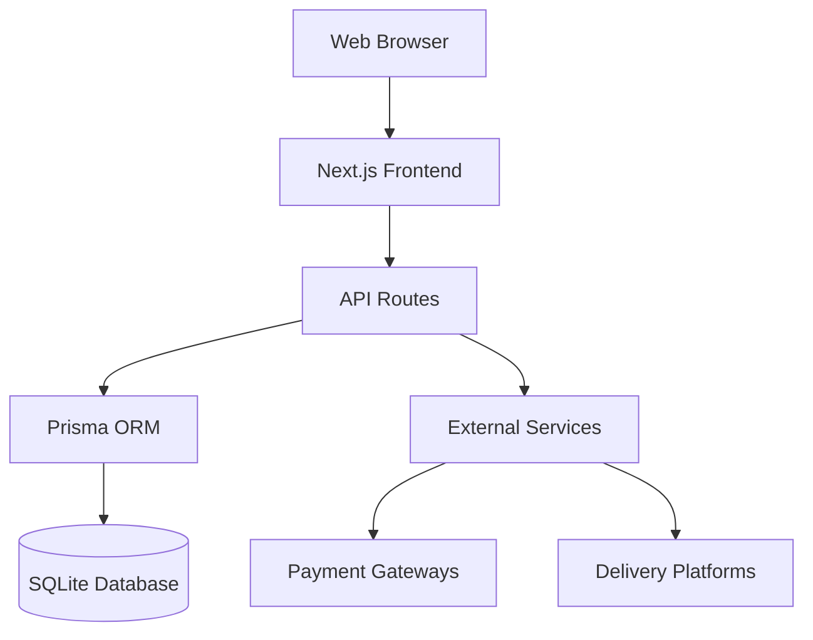
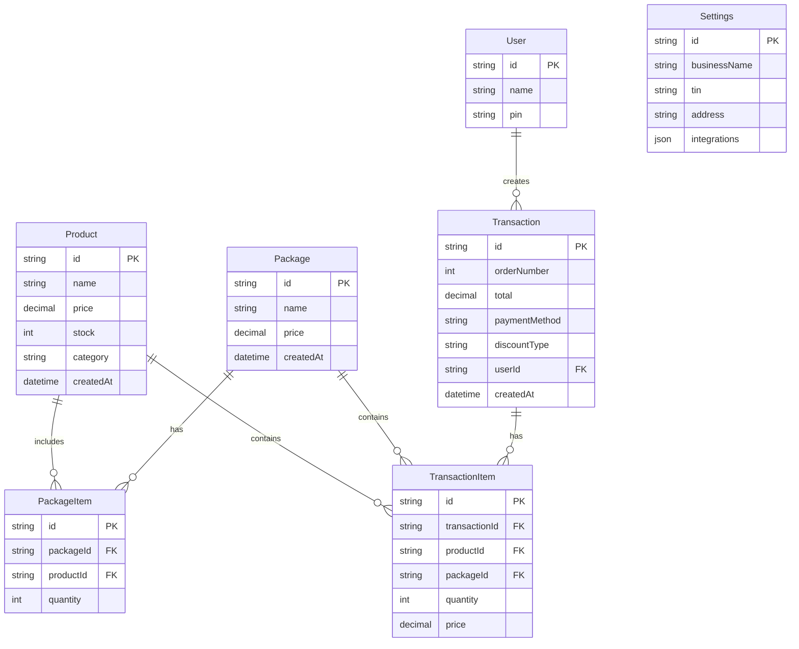
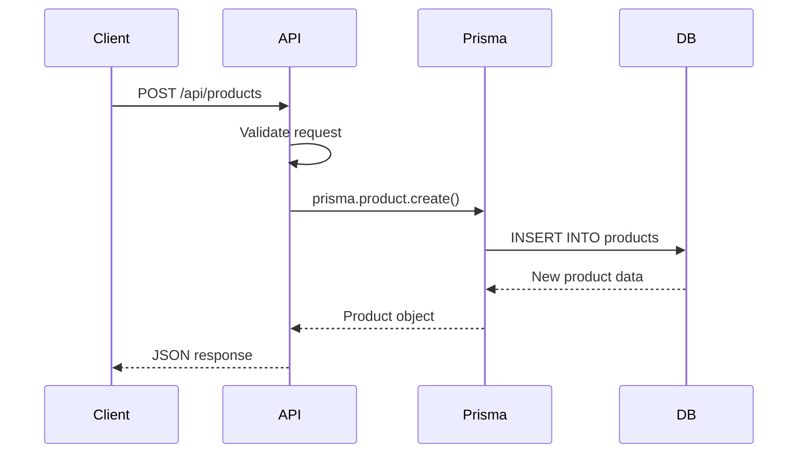
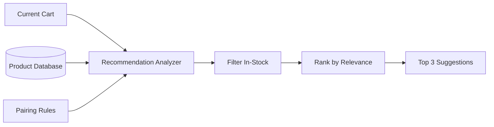

# Architecture Overview

Technical overview of the POS System architecture, technology stack, and design decisions.

## System Architecture

### High-Level Overview



### Tech Stack

| Layer | Technology | Purpose |
|-------|------------|---------|
| **Frontend** | Next.js 14 (App Router) | React-based UI framework |
| **Language** | TypeScript | Type-safe development |
| **Styling** | Tailwind CSS | Utility-first CSS framework |
| **UI Components** | shadcn/ui | Pre-built accessible components |
| **Database** | SQLite | Lightweight embedded database |
| **ORM** | Prisma | Type-safe database client |
| **Icons** | Lucide React | Modern icon library |

## Project Structure

```text
pos-app/
├── app/                      # Next.js App Router
│   ├── api/                  # Backend API routes
│   │   ├── products/         # Product CRUD
│   │   ├── packages/         # Package management
│   │   ├── transactions/     # Transaction history
│   │   ├── recommendations/  # AI suggestions
│   │   └── settings/         # Configuration
│   ├── inventory/            # Inventory management page
│   ├── settings/             # Settings page
│   ├── transactions/         # Transaction history page
│   ├── layout.tsx            # Root layout
│   └── page.tsx              # Main POS interface
├── components/               # React components
│   ├── ui/                   # shadcn/ui components
│   ├── Header.tsx            # App header
│   ├── Receipt.tsx           # Receipt generator
│   ├── ProductGrid.tsx       # Product display
│   └── Cart.tsx              # Shopping cart
├── lib/                      # Utility functions
│   ├── db.ts                 # Prisma client
│   └── utils.ts              # Helper functions
├── prisma/                   # Database
│   ├── schema.prisma         # Database schema
│   ├── seed.ts               # Seed data
│   └── dev.db                # SQLite database file
└── public/                   # Static assets
```

## Database Schema

### Entity Relationship Diagram



### Key Models

#### Product

- Core inventory item
- Tracks stock levels
- Categorized for organization

#### Package

- Bundle of multiple products
- Independent pricing
- Contains PackageItems

#### Transaction

- Represents a complete sale
- Auto-incrementing order number
- Links to TransactionItems

#### Settings

- Global configuration
- Business details for BIR compliance
- Integration credentials (encrypted)

## Frontend Architecture

### Component Hierarchy

```text
App Layout
├── Header
│   ├── Logo
│   ├── Navigation Icons
│   └── User Menu
├── POS Page
│   ├── ProductGrid
│   │   ├── SearchBar
│   │   └── ProductCard[]
│   ├── Cart
│   │   ├── CartItem[]
│   │   ├── SmartSuggestions
│   │   └── CheckoutButton
│   └── PaymentDialog
│       ├── PaymentMethods
│       └── Receipt
├── Inventory Page
│   ├── Tabs (Products / Packages)
│   ├── ProductList
│   └── Forms
└── Settings Page
    ├── BusinessInfo
    ├── PaymentGateways
    └── DeliveryPlatforms
```

### State Management

**Approach**: React hooks + Server Actions

- **Client State**: `useState`, `useEffect` for UI state
- **Server State**: Next.js Server Actions for data mutations
- **Real-time Updates**: Optimistic UI updates with revalidation

**Example - Adding to Cart:**

```typescript
const [cart, setCart] = useState<CartItem[]>([]);

const addToCart = (product: Product) => {
  setCart(prev => {
    const existing = prev.find(item => item.id === product.id);
    if (existing) {
      return prev.map(item =>
        item.id === product.id
          ? { ...item, quantity: item.quantity + 1 }
          : item
      );
    }
    return [...prev, { ...product, quantity: 1 }];
  });
};
```

## Backend Architecture

### API Routes

All API routes follow Next.js App Router conventions:

```text
/app/api/[resource]/route.ts
```

**Standard CRUD Operations:**

| Method | Route | Description |
|--------|-------|-------------|
| GET | `/api/products` | List all products |
| POST | `/api/products` | Create product |
| PATCH | `/api/products/[id]` | Update product |
| DELETE | `/api/products/[id]` | Delete product |

### Request/Response Flow



### Data Validation

**Using Zod schemas** (recommended for future enhancement):

```typescript
import { z } from 'zod';

const ProductSchema = z.object({
  name: z.string().min(1),
  price: z.number().positive(),
  stock: z.number().int().nonnegative(),
  category: z.string()
});
```

## AI Recommendation System

### Architecture



### Algorithm Flow

1. **Input**: Current cart items
2. **Analysis**: Find complementary products based on:
   - Category matching
   - Historical pairings
   - Predefined rules
3. **Filtering**: Remove:
   - Items already in cart
   - Out-of-stock products
   - Irrelevant categories
4. **Ranking**: Score by:
   - Pairing frequency
   - Profit margin
   - Stock availability
5. **Output**: Top 3-5 suggestions

See [AI Smart Recommendations](AI-Smart-Recommendations) for details.

## Security Considerations

### Current Implementation

1. **PIN Authentication**: Basic user login
2. **No External Auth**: Self-contained system
3. **Local Database**: SQLite on same machine

### Production Recommendations

> [!WARNING]
> Before deploying to production, implement:
>
> - Proper authentication (JWT, OAuth)
> - HTTPS/TLS encryption
> - Database access controls
> - API rate limiting
> - Input sanitization
> - Environment variable secrets

### Data Security

**Sensitive Data:**

- Payment gateway API keys → Encrypted in database
- User PINs → Hashed (recommended)
- Business TIN → Stored securely

## Performance Optimizations

### Current Optimizations

1. **Server-Side Rendering**: Fast initial page loads
2. **Static Generation**: Build-time optimization for public pages
3. **Image Optimization**: Next.js automatic image optimization
4. **Database Indexing**: Indexed on commonly queried fields

### Scalability Considerations

**Current Limitations:**

- SQLite → Limited to single server
- No caching layer
- Synchronous API calls

**Future Enhancements:**

- Migrate to PostgreSQL for multi-location support
- Implement Redis caching
- Add CDN for static assets
- Horizontal scaling with load balancers

## Design Patterns

### Repository Pattern

Prisma acts as the data access layer, abstracting database operations.

### Service Layer (Recommended)

For complex business logic:

```typescript
// services/transactionService.ts
export class TransactionService {
  async createTransaction(data: TransactionInput) {
    // Handle stock deduction
    // Generate order number
    // Create transaction record
    // Return receipt data
  }
}
```

### Component Composition

Reusable UI components:

- `Button`, `Card`, `Dialog` from shadcn/ui
- Custom components like `ProductCard`, `Receipt`

## Development Workflow

### Local Development

```bash
npm run dev          # Start dev server
npx prisma studio    # Database GUI
npm run build        # Production build
npm run lint         # Code linting
```

### Database Migrations

```bash
npx prisma db push   # Push schema changes
npx prisma generate  # Regenerate Prisma Client
npx prisma db seed   # Seed database
```

### Git Workflow

1. Create feature branch
2. Make changes
3. Run tests (when available)
4. Commit with clear messages
5. Open pull request

## Testing Strategy

> [!NOTE]
> **Coming Soon**: Comprehensive test suite

**Planned Tests:**

- Unit tests for utilities
- Integration tests for API routes
- E2E tests for critical user flows
- Visual regression tests for UI

## Deployment

### Production Build

```bash
npm run build
npm start
```

### Environment Variables

```env
# Database
DATABASE_URL="file:./prisma/prod.db"

# API Keys (Production)
GCASH_LIVE_API_KEY="encrypted_key"
MAYA_LIVE_API_KEY="encrypted_key"

# App Config
NODE_ENV="production"
NEXT_PUBLIC_APP_URL="https://your-domain.com"
```

### Hosting Options

- **Vercel**: Easiest for Next.js apps
- **DigitalOcean**: VPS for full control
- **AWS/GCP/Azure**: Enterprise-grade cloud
- **Self-hosted**: Local server or Raspberry Pi

See [Deployment Guide](Deployment-Guide) (coming soon).

## Dependencies

Key packages and versions:

```json
{
  "next": "^14.0.0",
  "react": "^18.2.0",
  "typescript": "^5.0.0",
  "@prisma/client": "^5.0.0",
  "tailwindcss": "^3.3.0",
  "lucide-react": "^0.263.0"
}
```

## Learn More

- [Database Schema](Database-Schema) - Detailed schema documentation
- [API Documentation](API-Documentation) - All API endpoints
- [Contributing](Contributing) - Development guidelines

---

**Questions?** Open an issue on [GitHub](https://github.com/Keshigami/POS-System/issues).

## Multi-Store Architecture (Phase 4)

### Overview

The system supports multiple physical store locations managed under a single deployment. This is achieved through a **Multi-Tenant** database design where all core entities are linked to a specific `Store`.

### Data Isolation Strategy

```mermaid
graph TD
    StoreA[Store A (Manila)]
    StoreB[Store B (Cebu)]
    
    subgraph "Shared Database"
        UserA[User: Manager A] -->|storeId| StoreA
        UserB[User: Manager B] -->|storeId| StoreB
        
        ProdA[Product: Pandesal] -->|storeId| StoreA
        ProdB[Product: Dried Mango] -->|storeId| StoreB
        
        OrderA[Order #101] -->|storeId| StoreA
        OrderB[Order #205] -->|storeId| StoreB
    end
```

### Key Components

1. **Store Model**: The root entity for tenancy.

    ```prisma
    model Store {
      id       String @id @default(cuid())
      name     String
      location String?
      users    User[]
      products Product[]
      orders   Order[]
    }
    ```

2. **User Association**: Users are assigned to a single store (currently).
    - `User.storeId`: Foreign key linking staff to their branch.
    - **Role-Based Access**:
        - `ADMIN`: Can manage all stores (future).
        - `MANAGER`: Can manage their specific store.
        - `STAFF`: Can process sales in their specific store.

3. **Inventory Segregation**:
    - Products are unique to each store.
    - Allows different pricing and stock levels per location.

4. **Authentication**:
    - **Google Login** (NextAuth.js) identifies the user.
    - System looks up the user's `storeId` to determine context.
