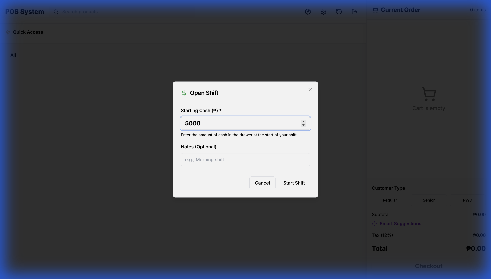

# Shift Management (X/Z Reading)

The POS system includes comprehensive shift management with cash control and end-of-day reporting.

## Overview

Shift management enforces proper cash drawer accountability by requiring cashiers to:

1. **Declare starting cash** at shift opening
2. **Track all transactions** during the shift
3. **Reconcile cash** at shift closing
4. **Generate Z-Reading** reports for auditing

## Opening a Shift

When you first access the POS, an "Open Shift" modal appears automatically:


**Steps:**

1. Enter the **Starting Cash** amount in the drawer (e.g., ₱5,000)
2. Add optional **Notes** (e.g., "Morning shift - John")
3. Click **"Start Shift"**

> **Note**: You cannot process transactions without an active shift.

## During the Shift



- All orders automatically link to the current shift
- A **"Close Shift"** button appears in the top-right header
- Transactions are tracked by payment method for reporting

## Closing a Shift

Click the **"Close Shift"** button in the header to end your shift:

### Cash Reconciliation

1. **Count the drawer** - Physically count all cash
2. **Enter Actual Cash** - Input the counted amount
3. **Review Variance** - System shows difference from expected

**Variance Indicators:**

- 🟢 **Perfect Match** (₱0.00) - No variance
- 🔵 **Overage** (+₱50.00) - More cash than expected
- 🔴 **Shortage** (-₱25.00) - Less cash than expected

If there's a variance, the system shows a yellow warning box prompting you to recount or add notes explaining the discrepancy.

### Z-Reading Report

After closing the shift, a comprehensive Z-Reading report is auto-generated:

**Report Includes:**

- **Shift Summary**: Start/end times, cashier name, store location
- **Sales Breakdown**:
  - Cash Sales: ₱8,200.00
  - Card Sales: ₱2,500.00
  - GCash: ₱1,450.00
  - PayMaya: ₱300.00
  - **Total Sales**: ₱12,450.00
- **Cash Reconciliation**:
  - Opening Cash: ₱5,000.00
  - Expected Cash: ₱13,200.00
  - Actual Cash: ₱13,250.00
  - **Variance**: +₱50.00
- **Statistics**:
  - Total Orders: 45
  - Average Order Value: ₱276.67
  - Total Discounts: ₱320.00

**Print**: Click "Print Report" to generate a physical copy for records.

## API Endpoints

### Open Shift

```http
POST /api/shifts
Content-Type: application/json

{
  "startCash": 5000,
  "userId": "user-id",
  "storeId": "store-id",
  "notes": "Morning shift"
}
```

### Get Current Shift

```http
GET /api/shifts
```

### Close Shift

```http
PATCH /api/shifts/{shiftId}/close
Content-Type: application/json

{
  "endCash": 13250,
  "notes": "All accounted for"
}
```

### Get Z-Reading

```http
GET /api/shifts/{shiftId}/z-reading
```

## Database Schema

```prisma
model Shift {
  id           String   @id @default(cuid())
  userId       String
  storeId      String
  startCash    Float
  endCash      Float?
  expectedCash Float?
  variance     Float?
  status       String   @default("OPEN") // OPEN, CLOSED
  startTime    DateTime @default(now())
  endTime      DateTime?
  notes        String?
  orders       Order[]
}
```

## Demo


Watch the complete flow from opening a shift to closing it.

## Best Practices

✅ **Count carefully** - Double-check cash before entering  
✅ **Document variances** - Add notes explaining discrepancies  
✅ **Print Z-Readings** - Keep physical records for auditing  
✅ **One shift per day** - Close at end of business day  
✅ **Secure reports** - Store Z-Readings safely for tax compliance

## Troubleshooting

**Q: I can't access the POS**  
A: Make sure you've opened a shift first.

**Q: My cash doesn't match**  
A: Recount the drawer. If still different, add notes and report to management.

**Q: Can I open multiple shifts?**  
A: No, only one shift can be open at a time per store.

**Q: Where are Z-Readings stored?**  
A: In the database linked to each shift record. Access via `/api/shifts/{id}/z-reading`.
